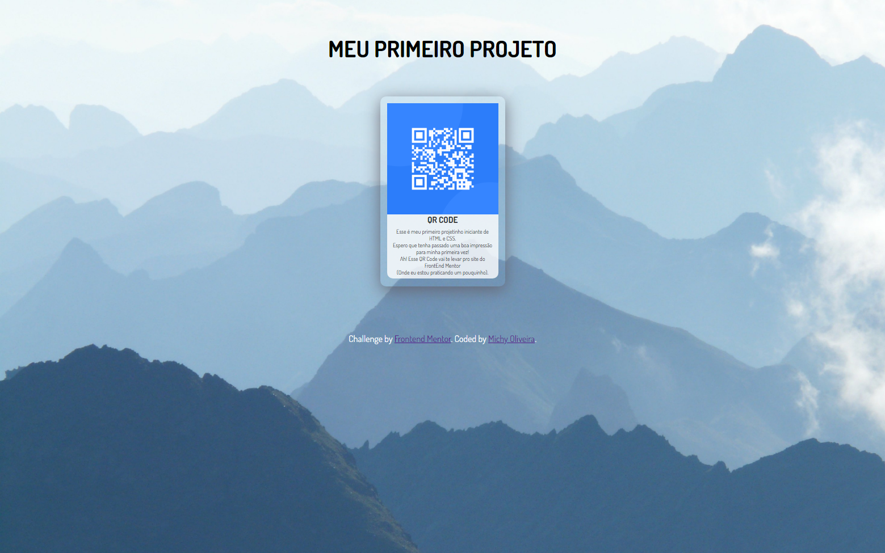

# Frontend Mentor - QR code Challenge

Essa é a minha solução para [QR code component challenge on Frontend Mentor](https://www.frontendmentor.io/challenges/qr-code-component-iux_sIO_H).

## Table of contents

- [Overview](#overview)
  - [Screenshot](#screenshot)
  - [Links](#links)
- [My process](#my-process)
  - [Built with](#built-with)
- [Author](#author)

## Overview

### Screenshot

### Links

- Solution URL: [https://github.com/MichyOliveira/Meus-Primeiros-Projetos.git](index.html)
- Live Site URL: [https://meus-primeiros-projetos-3l9l-jn3lg4avu-michyoliveiras-projects.vercel.app/](http://127.0.0.1:5500/index.html)

## My process

### Built with

- Semantic HTML5 markup
- CSS

## Author

- Website - [https://github.com/MichyOliveira](https://github.com/MichyOliveira)
- Frontend Mentor - [@MichyOliveira](https://www.frontendmentor.io/profile/MichyOliveira)
- Twitter - [@miiholiveira37](https://x.com/miiholiveira37)
